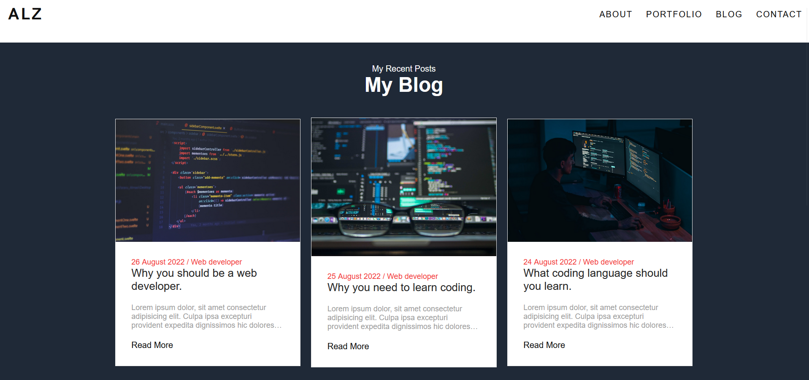

# T1A2 - Kwong Fei Alvin Lai Portfolio

[Github repo](https://github.com/BigAlzzz/KwongFeiAlvinLai_T1A2)

[Netlify Link](https://630b458d6d86c22fed968adf--friendly-cat-f0db65.netlify.app/)

## Purpose

The purpose of this website is to apply HTML and CSS foundations learnt from Coder Academy to a portfolio webpage. This portfolio can be used and updated to advertise my skills as a web developer.

## Features

The overall webpage is designed according to a few useability heuristics. These heuristics are as follows.
-Visibility of system status: Users are able to see what webpage they are on.
-User control and freedom: There are links to lead to other pages of the website and functionality to go back.
-Aesthetic and minimalist design: Webpage should not be complicated and follow a constant standard formatting.
The webpage consists of.
-Homepage: Users are able to catch a glimpse of me through an image. They are able to access the other pages through the navigation bar.
-About: Text that introduces the user to me. Users are able to view and download a resume on this page.
-Portfolio: Page contains projects that I have completed. Users are able to access these through click on the project title.
-Blog: Users keep up to date on the blogs that I write here. 
-Contact: Users can send a message to me through the use of a form on this page.

## Site Map

## Webpage screenshot

## Homepage

## About

## Portfolio

## Blog

## Contact

## Target Audience

The target audience is for prospective employers and developers. Allows others to know what projects I am capable of and what skills I possess as a developer.

## Tech Stack

Made with HTML and CSS. Wireframes done with pen and paper.
